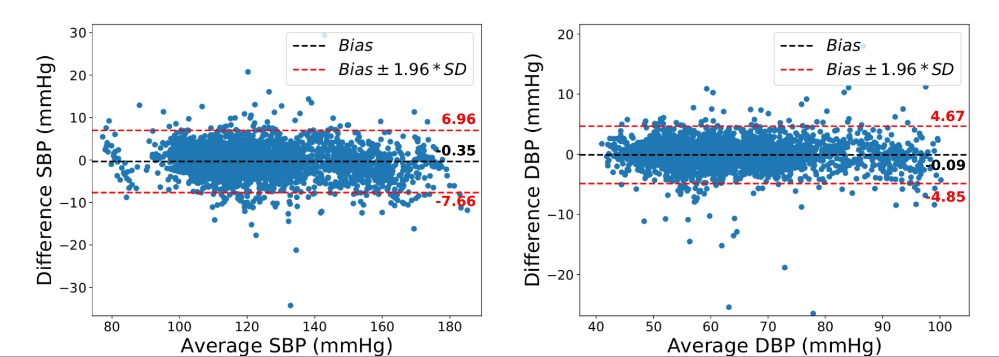
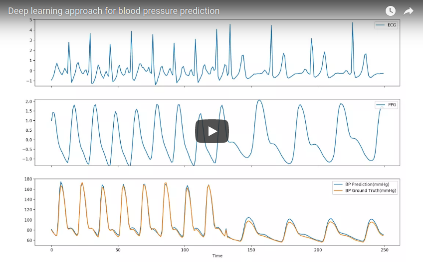

# Long-term Blood Pressure Prediction with Deep Recurrent Neural Networks

Existing methods for arterial blood pressure (BP) estimation directly map the input physiological signals to output BP values without explicitly modeling the underlying temporal dependencies in BP dynamics. As a result, these models suffer from accuracy decay over a long time and thus require frequent calibration. In this work, we address this issue by formulating BP estimation as a sequence prediction problem in which both the input and target are temporal sequences. We propose a novel deep recurrent neural network (RNN) consisting of multilayered Long Short-Term Memory (LSTM) networks, which are incorporated with (1) a bidirectional structure to access larger-scale context information of input sequence, and (2) residual connections to allow gradients in deep RNN to propagate more effectively.

## Model

## Result

## Demo

## Citation
    @article{su2017predicting,
      Author = {Su, Peng and Ding, Xiao-Rong and Zhang, Yuan-Ting and Liu, Jing and Miao, Fen and Zhao, Ni},
      Title = {Long-term Blood Pressure Prediction with Deep Recurrent Neural Networks},
	    Journal = {arXiv preprint arXiv:1705.04524},
	  Year = {2017}
    }
    
Due to the patent issue, the code and dataset will be released later. 
  
